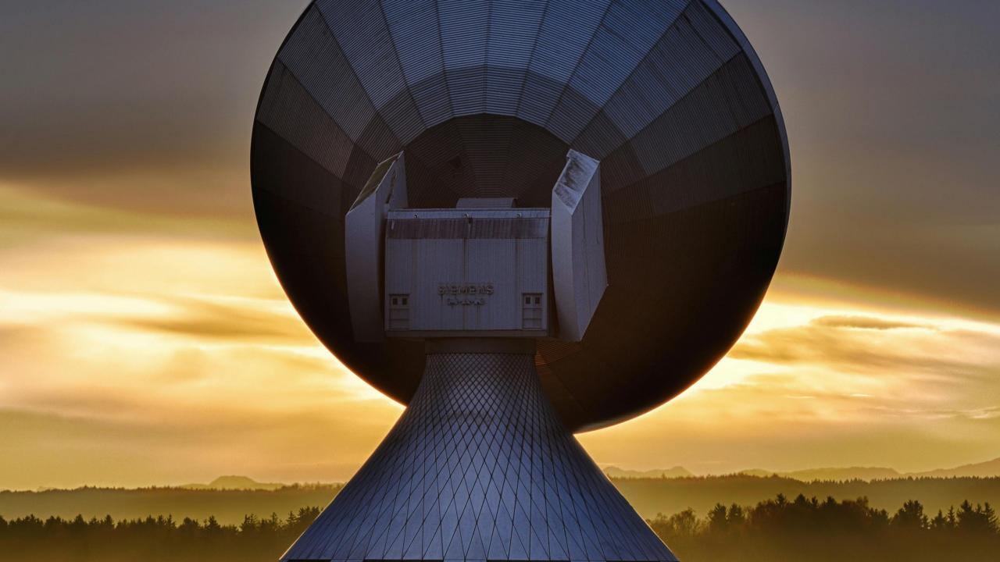
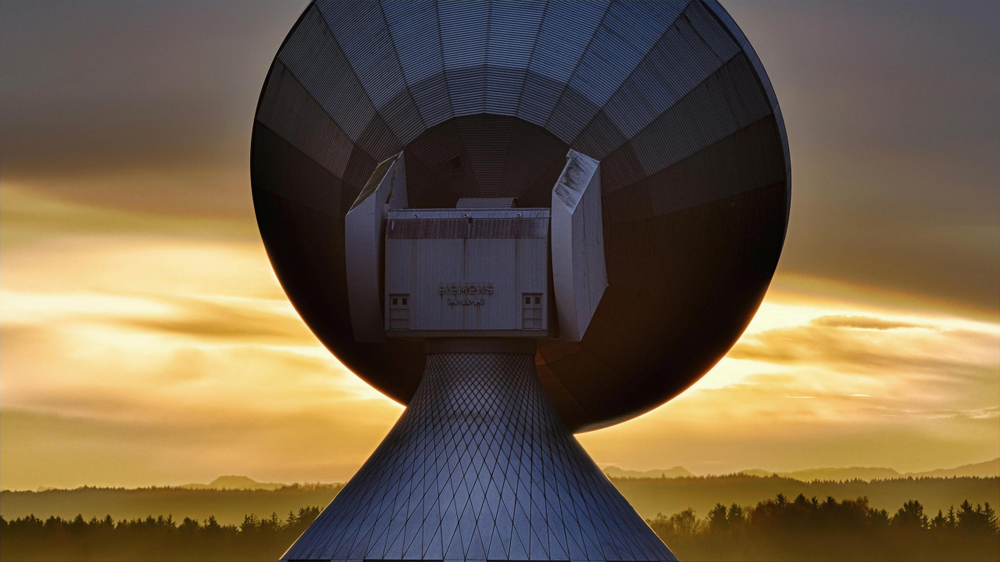
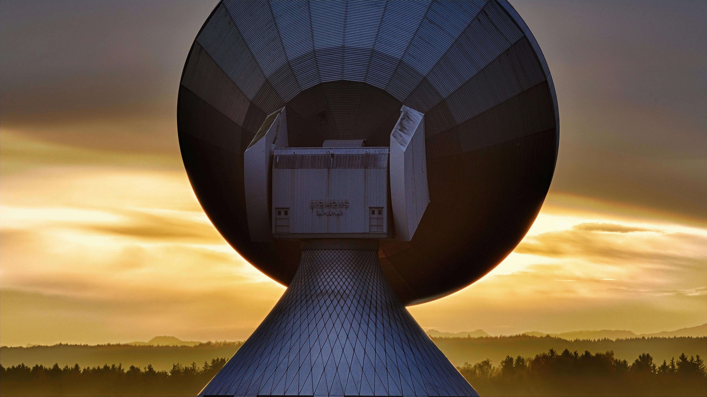

# Fast Transformer Upscaling

## Overview

We present a **Transformer-based Single Image Super-Resolution (SISR) model** that enhances low-resolution images using a hybrid **CNN-Transformer** architecture. By leveraging both **local feature extraction** and **global self-attention**, the model achieves high-quality image upscaling across multiple magnification factors (2, 3, 4, 6).

## Model Architecture

The model is structured as follows:

1. **CNN Encoder**  
   - Extracts local features from the low-resolution input.  
   - Uses a shallow convolutional network with ReLU activations.  

2. **Patch Embedding**  
   - Converts feature maps into tokenized representations.  
   - Organizes data into structured tokens suitable for Transformer processing.

3. **Window-Based Transformer Processing**  
   - The tokenized feature map is divided into **non-overlapping windows**.  
   - A series of **Transformer blocks** process these windows independently.  
   - Relative positional encoding helps retain spatial relationships.

4. **Patch Unembedding**  
   - Converts Transformer-processed tokens back into a feature map.  
   - Reconstructs the intermediate representation before upscaling.

5. **Residual Upscaling**  
   - A parallel CNN-based branch upscales the image.  
   - A second branch reconstructs a **low frequency residual**.  
   - The final output is obtained by **adding the residual to the upscaled image**.

6. **Pixel Shuffle Upsampling**  
   - Uses **CNN layers and Pixel Shuffle operations** to refine high-resolution outputs.  

## Image Comparisons

The following examples showcase the model's upscaling performance on sample images.

### **Example 1**
| Original | 2× Upscale | 3× Upscale | 4× Upscale | 6× Upscale |
|----------|-----------|-----------|-----------|-----------|
|  |  |  |  |  |

### **Example 2**
| Original | 2× Upscale | 3× Upscale | 4× Upscale | 6× Upscale |
|----------|-----------|-----------|-----------|-----------|
|  |  |  |  |  |

These examples highlight the model's ability to **preserve fine details** and **enhance resolution** while reducing artifacts.

## Key Features

- **Hybrid CNN-Transformer Approach**  
  - Uses **CNNs for local feature extraction** and **Transformers for global attention**.  

- **Window-Based Processing for Efficiency**  
  - Reduces complexity while maintaining context-awareness through **non-overlapping windows**.

- **Multi-Scale Upscaling**  
  - Supports **multiple magnification levels** (2×, 3×, 4×, 6×) using a single model.

- **Residual Learning for Detail Enhancement**  
  - Uses a **residual connection** to allow the model to focus on learning high frequency details

