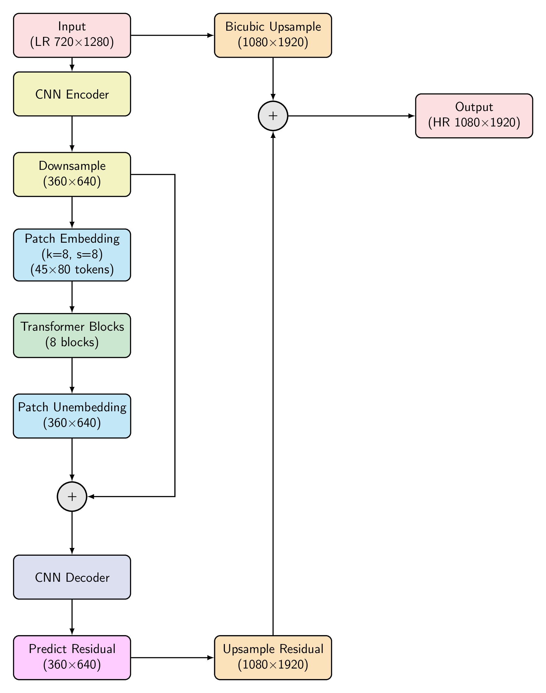

# TransformerUpscaler
### ML@SJSU

## Transformer Model Architecture

## Train
`python train.py --data_dir images/training_set`

## Inference (single image)
`python inference.py --image_path images/training_set/image_0.jpg --out_res 1080`

## Results Comparison

<table>
  <tr>
    <th style="text-align:center;">Low Resolution Input (1280×720)</th>
    <th style="text-align:center;">Upscaled Output (1920×1080)</th>
  </tr>
  <tr>
    <td style="text-align:center;">
      

        
        
Original

      

    </td>
    <td style="text-align:center;">
      

        
        
Upscaled image

      

    </td>
  </tr>
  <tr>
    <td style="text-align:center;">
      

        
        
Original

      

    </td>
    <td style="text-align:center;">
      

        
        
Upscaled image

      

    </td>
  </tr>
</table>