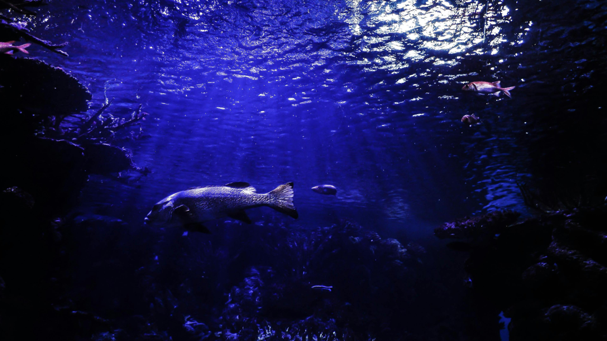
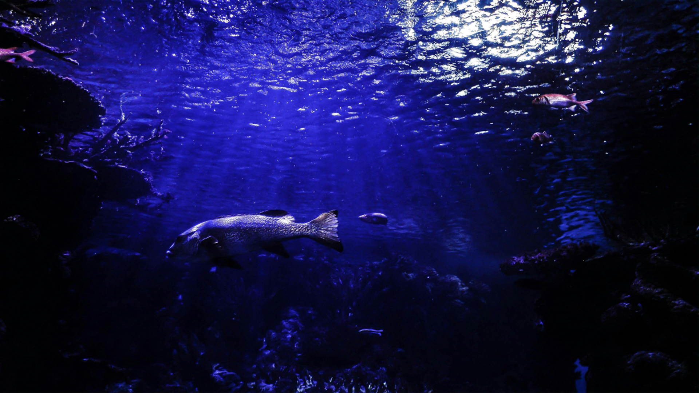

# TransformerUpscaler
### ML@SJSU

## Train
`python train.py --data_dir images/training_set`
## Inference (single image)
`python inference.py --image_path images/training_set/image_0.jpg`

## Demo
Input 720x1280

Output 1080x1920

Input 720x1280

Output 1080x1920
