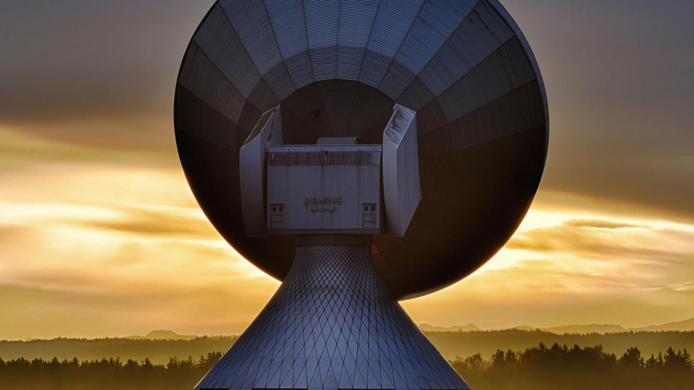
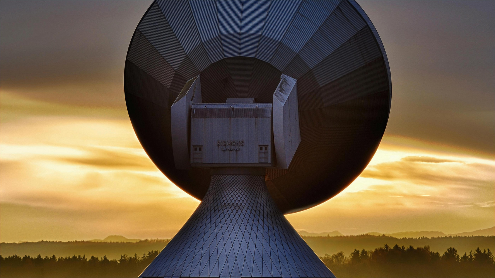
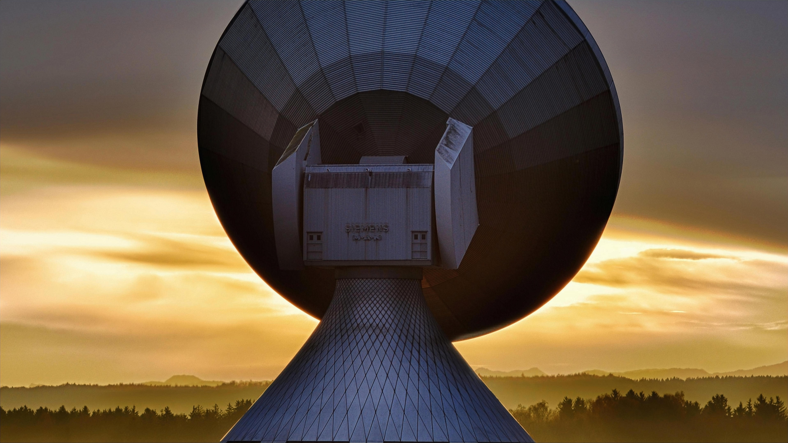

# TransformerUpscaler

A controlled study of attention design for single-image super-resolution (SISR).

One training harness, one dataset, one evaluation protocol, and six architectures — from
window-only local attention through a hybrid local + coarse-global design with gated residual
scaling. A single trained model serves 2×, 3×, 4×, and 6× upscaling.

The point of this repo is not to beat SwinIR. It is to make the comparison *between these
variants* airtight: same data, same harness, same protocol, with a bicubic reference measured
by that same harness so every number in the table is directly comparable to every other.

---

## Architecture

```
LR input
   │
   ├─ CNN encoder ─────────── shallow conv stack, local feature extraction
   │
   ├─ Patch embedding ─────── Conv2d(k=8, s=8) → tokens
   │
   ├─ Attention trunk ─────── N × ResidualHABBlock, each containing:
   │       ├─ HybridAttentionBlock   shifted / non-shifted window self-attention
   │       │                          with relative positional encoding      (local)
   │       ├─ CoarseGlobalAttention  pooled attention over the whole map     (global)
   │       └─ HAI gate               out + α ⊙ x,  α per-channel, zero-init
   │
   ├─ Patch unembedding ───── ConvTranspose2d(k=8, s=8) → feature map
   │
   └─ Residual upscaling ──── CNN branch + low-frequency residual branch,
                              combined and refined via PixelShuffle
HR output
```

**The design claim.** Window attention is cheap but blind past the window edge. A pooled global
path restores long-range context at low cost. `HAI` — a per-channel learnable scale on each
block's residual, initialised at zero — lets the network start as an identity map and admit each
attention block only as far as training warrants, which is what makes the deeper variants
trainable at this budget.

This is **hybrid local-window and coarse-global attention with gated residual scaling**. It is
not a hierarchical attention mechanism, and earlier drafts of this README overstated it.

---

## Results — Urban100, ×4

| Model | Params | PSNR (Y) ↑ | SSIM (Y) ↑ | Δ PSNR vs bicubic | s/img (CPU) |
|---|---:|---:|---:|---:|---:|
| Bicubic (reference) | — | 21.815 | 0.6358 | — | — |
| `FastTransformer` | 4.31M | 21.685 | 0.5627 | -0.130 | 0.95 |
| `WindowTransformer` | 2.76M | 21.880 | 0.6353 | +0.065 | 0.09 |
| `Fastv2` | 7.65M | 22.228 | 0.6137 | +0.413 | 7.25 |
| `SwinBased/deep_hai_P` | 6.06M | 22.117 | 0.6509 | +0.302 | 0.88 |
| `SwinBased/wide_hai_P` | 9.28M | 22.220 | 0.6431 | +0.405 | 0.90 |
| **`SwinBased/base_hai`** ★ | 6.06M | 22.536 | 0.6700 | +0.721 | 0.88 |

### Urban100, ×2

| Model | Params | PSNR (Y) ↑ | SSIM (Y) ↑ | Δ PSNR vs bicubic | s/img (CPU) |
|---|---:|---:|---:|---:|---:|
| Bicubic (reference) | — | 25.547 | 0.8297 | — | — |
| `FastTransformer` | 4.31M | 24.477 | 0.7483 | -1.070 | 1.53 |
| `WindowTransformer` | 2.76M | 25.675 | 0.8311 | +0.128 | 0.26 |
| `Fastv2` | 7.65M | not run | not run | — | — |
| `SwinBased/deep_hai_P` | 6.06M | 26.149 | 0.8449 | +0.602 | 1.63 |
| `SwinBased/wide_hai_P` | 9.28M | 26.004 | 0.8221 | +0.457 | 1.15 |
| **`SwinBased/base_hai`** ★ | 6.06M | 26.746 | 0.8546 | +1.199 | 1.04 |

`Fastv2` at ×2 is the one cell not filled in: it is by far the slowest model here (7.25 s/img at ×4, and ×2 quadruples the token count), and the run exceeded the wall-clock budget on the CPU box used for this sweep. It is marked *not run* rather than quietly omitted.

Measured on the full 100-image Urban100 set (Huang et al., CVPR 2015), CPU inference, fp32.
Reproduce any row with:

```bash
python eval_metrics.py --model SwinBased/base_hai --data_dir data/Urban100 --scale 4
```

### Protocol

Matches the convention used by EDSR and SwinIR:

1. Crop each HR image to a multiple of `scale` **before** downsampling, so the model output
   lands on exactly the HR size and the prediction is never resampled.
2. Bicubic-downsample the cropped HR to produce the LR input.
3. Crop `scale` pixels from every border before scoring.
4. Score the Y channel of YCbCr in fp32, with MATLAB-convention SSIM
   (`gaussian_weights=True, sigma=1.5, use_sample_covariance=False`).

`eval_metrics.py` raises rather than resampling if a model returns the wrong size — a size
mismatch is an upsampler bug, and papering over it silently invalidates the metric.

### Reading these numbers honestly

**Do not compare the absolute values to published Urban100 tables.** Published work reports
bicubic at ≈23.14 dB / 0.6573 for ×4; this harness measures bicubic at
21.815 dB / 0.6358.
The gap is the LR degradation model: papers use MATLAB `imresize` with antialiasing, this repo
uses PIL `BICUBIC`. That shifts the whole scale by roughly a decibel and makes cross-paper
comparison meaningless.

What the table *does* support is the internal comparison, because the bicubic row came out of the
identical pipeline. On that basis, at ×4:

- `FastTransformer`, the earliest variant, is **below** the bicubic reference on both metrics.
- `WindowTransformer` — local windows only, and the smallest model here — reaches roughly bicubic
  parity at a fraction of the cost (0.09 s/img).
- The hybrid local + coarse-global variants all clear bicubic, and `SwinBased/base_hai` is the
  only model that wins on **both** PSNR and SSIM by a clear margin (+0.72 dB, +0.034 SSIM).
- `Fastv2` gets within 0.3 dB of the best model but takes 8× the inference time and loses badly
  on SSIM, which is the argument for the windowed design over dense attention.

The ×2 table tells the same story with a wider margin — `SwinBased/base_hai` leads on both
metrics again (+1.20 dB), and the ordering of the variants is unchanged. A result that holds
across two scale factors is worth more than either row alone.

These are small models trained on a single consumer GPU over one semester. They are not
competitive with models trained on DIV2K+Flickr2K for hundreds of epochs, and this table is not
arranged to suggest otherwise.

### The ablation is not done yet

`HAI` is now gated behind a `use_hai` flag, so a true control can be trained:

```bash
python train.py --model SwinBased/base_hai --use_hai false --data_dir data/DIV2K
```

With `use_hai=False` no `alpha` parameters are created; the control differs from the gated model
by exactly its 36 `alpha` tensors and every other state-dict key is identical.

**All three committed SwinBased checkpoints were trained with HAI enabled**, so the
does-gating-help question is currently unanswered. The directory now named `base_hai` was
previously called `non_hai`, which was simply wrong — it contained and instantiated the same
`HAI` blocks as the other two. Running that control is the outstanding work on this repo.

---

## Local Attribution Maps

LAM ([Gu & Dong, CVPR 2021](https://arxiv.org/abs/2011.11036)) traces which input pixels a
super-resolution network actually uses to reconstruct a target patch — direct evidence for
whether the coarse-global path is being used or ignored.

```bash
python lam.py --model SwinBased/deep_hai_P --image images/image_100.png --scale 4
```

---

## Demos

| Original | 2× | 3× | 4× | 6× |
|---|---|---|---|---|
|  |  |  |  |  |
|  |  |  |  |  |

---

## Quickstart

```bash
git clone https://github.com/Exidekat/TransformerUpscaler.git
cd TransformerUpscaler
pip install -r requirements.txt          # add -r requirements-demo.txt for the screen overlay
```

**Get the benchmark set**

```bash
mkdir -p data/Urban100
# Urban100 HR images (Huang et al., CVPR 2015)
git clone --depth 1 --filter=blob:none --sparse https://github.com/jbhuang0604/SelfExSR /tmp/selfexsr
cd /tmp/selfexsr && git sparse-checkout set data/Urban100/image_SRF_4 && cd -
cp /tmp/selfexsr/data/Urban100/image_SRF_4/*_HR.png data/Urban100/
```

**Upscale an image**

```bash
python inference.py --model SwinBased/base_hai --image path/to/input.png --scale 4
```

**Evaluate**

```bash
python eval_metrics.py --model SwinBased/base_hai --data_dir data/Urban100 --scale 4
bash tools/run_eval_all.sh          # every model, every scale
```

**Train**

```bash
python train.py --model SwinBased/base_hai --data_dir data/DIV2K --epochs 300 --batch_size 32
python train.py --model SwinBased/base_hai --use_hai false --data_dir data/DIV2K   # ablation control
```

Checkpoints live under `models/<Name>/checkpoints/`. The largest are committed to the repo for
now, which makes a full clone heavy — they will move to Releases.

---

## Repository layout

| Path | What it is |
|---|---|
| `models/<Name>/model.py` | One architecture per directory, each exposing `TransformerModel` |
| `models/SwinBased/` | The three hybrid local+global variants — see [its README](models/SwinBased/README.md) |
| `train.py` | Training loop — L1 with optional LPIPS perceptual loss |
| `eval_metrics.py` | PSNR/SSIM benchmark harness implementing the protocol above |
| `benchmark.py`, `speed_test.py` | Throughput and latency measurement |
| `ab_test.py` | Side-by-side comparison of two checkpoints |
| `lam.py`, `lam/` | Local Attribution Maps |
| `inference.py`, `overlay.py`, `app_overlay.py` | Single-image inference and a live screen-overlay demo |
| `data_handling/` | Dataset construction and preprocessing notebooks |
| `tools/` | Eval sweeps, training helpers, architecture diagram generation |

---

## Known limitations

- Non-overlapping windows block cross-window information flow; the coarse-global path only
  partially compensates.
- Trained at limited scale, so absolute PSNR is well below published baselines.
- The LR degradation model (PIL bicubic) differs from the MATLAB `imresize` convention used in
  the literature, so numbers here are internally comparable but not cross-comparable.
- The HAI ablation control has not been trained yet.
- `pixel_shuffle` at ×3 and ×6 takes a different code path than ×2/×4 and is less tuned.

## License

MIT — see [LICENSE](LICENSE).
